# 2025Fall-CV-FinalReport

<p align="center">
  <h1 align="center">Heavy Machine Out, We Have 3DGS Now!</h1>
  <p align="center"> Chunyu He · Zijie Xu · Peng Ma · Bingrui Guo · Ruiqi Li</p>
  <h3 align="center">25Fall Prof.Zhang's CV Course Project</h3>
  <div align="center"></div>
</p>

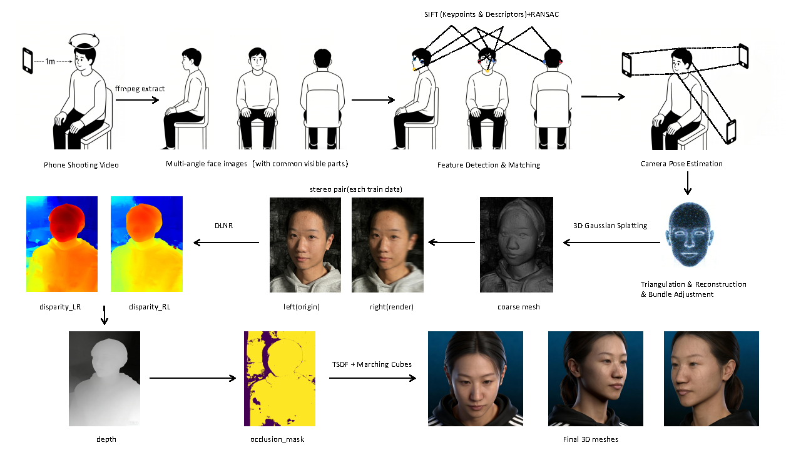

High-fidelity 3D facial reconstruction is crucial for clinical and consumer applications, yet existing professional systems are prohibitively expensive, immobile, and require controlled environments and expert operation. While recent advances in neural rendering offer promise, reconstructing clinically viable, watertight meshes from casually captured monocular smartphone video remains challenging due to motion blur, limited viewpoints, and illumination variability. We propose PFV-3D, a practical end-to-end framework that leverages the expressive power of 3D Gaussian Splatting (3DGS) to democratize high-quality 3D face modeling. Our pipeline integrates fisheye-aware camera modeling, robust pose initialization, and topology-aware mesh extraction to directly generate detailed, watertight 3D face meshes from short, handheld videos captured by everyday smartphones. We demonstrate that PFV-3D achieves reconstruction fidelity comparable to professional 3dMD systems at a fraction of the cost and complexity, enabling scalable and accessible 3D facial modeling without sacrificing clinical utility.
## Installation

**Environment**

First, clone the repository:
```bash
git clone https://github.com/yanivw12/gs2mesh.git
```
Then, create the environment, activate it and install dependencies:
```bash
# create the environment
conda create --name gs2mesh python=3.8
# activate the environment
conda activate gs2mesh
# install conda dependencies
conda install pytorch==2.3.1 torchvision==0.18.1 torchaudio==2.3.1 pytorch-cuda=11.8 cudatoolkit=11.8 colmap -c pytorch -c nvidia -c conda-forge
# install additional dependencies
cd gs2mesh
pip install -r requirements.txt
```

**Download DLNR Stereo weights**

```bash
# create the folder for the pretrained models
cd third_party/DLNR
mkdir pretrained
cd pretrained
# download Middlebury model
wget https://github.com/David-Zhao-1997/High-frequency-Stereo-Matching-Network/releases/download/v1.0.0/DLNR_Middlebury.pth
# download Sceneflow model
wget https://github.com/David-Zhao-1997/High-frequency-Stereo-Matching-Network/releases/download/v1.0.0/DLNR_SceneFlow.pth
```

**Download SAM2 weights**

SAM2 local weights is optional, as it automatically downloads weights using Huggingface. If you are still interested in local weights, download them and set the parameter *masker_SAM2_local* to True if using local weights.

```bash
# navigate to the folder for the pretrained model
cd third_party/segment-anything-2/checkpoints
# download pretrained model
wget https://dl.fbaipublicfiles.com/segment_anything_2/072824/sam2_hiera_large.pt
```


**Download GroundingDINO weights**

```bash
# create the folder for the pretrained model
cd third_party/GroundingDINO
mkdir weights
cd weights
# download pretrained model
wget https://github.com/IDEA-Research/GroundingDINO/releases/download/v0.1.0-alpha/groundingdino_swint_ogc.pth
```

## 3D Head Model Reconstruction and Registration Workflow
### 1. Prepare 3DMD Data
Obtain data from 3DMD, select the mesh data as the basis for the ground truth (GT), and use the local trimesh library.

### 2. Capture Head Video with Mobile Phone
When shooting the head video, ensure to capture from three normal vector angles: mid-face, forehead, and chin. Shooting from only one angle will result in poor reconstruction performance using COLMAP.

### 3. Local COLMAP Operation
#### 3.1 Download COLMAP
Download COLMAP locally. Although the task can be completed using command lines on a server, local operation guarantees speed and feasibility. Compiling COLMAP on the server may be more complex, as it requires various `sudo` commands; otherwise, installing dependencies will be extremely difficult.

#### 3.2 Configure COLMAP GUI
Open the COLMAP GUI and use the `autoconstruction` option with the following configurations:
- **Workspace folder**: The folder where results will be saved.

- **Image folder**: The folder storing images extracted from the video. Note: After frame extraction, ensure images in the "images" folder are in PNG format and named sequentially from `00001.png` onwards.
- **Mask folder**: Not required (leave unconfigured).
- For the format of video-extracted images, it is recommended to select the "video frame" option and use COLMAP's sequential mode for matching.
- Through practical comparison, there is no significant difference in whether camera parameters are shared, so this option does not need to be selected.

#### 3.3 Post-Run Operations
After clicking "RUN" to complete the reconstruction, navigate to the `sparse/0/` directory.
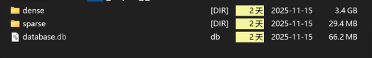

Notes:
- The original generated data only includes `.bin` files; `.txt` files are not generated with a single click.
- To export `.bin` models to `.txt` format:
  1. First import the mesh from `sparse/0/`
  2. Select "Export model as text" to convert the bin-format models to txt versions.
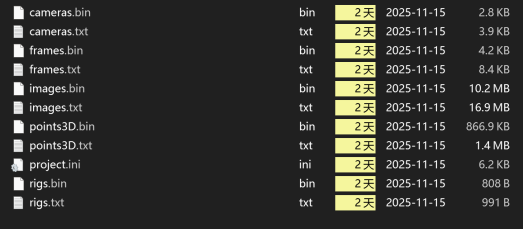
### 4. Server-Side GS2Mesh Pipeline
#### 4.1 Upload Files
Place the "images" and "sparse" folders into a single directory and upload it to the server path `data/custom`.

Notes:
- The "images" folder contains all image files. Due to the current video frame extraction algorithm, the image format is PNG.
- When generating the `Rento_COLMAP_SfM.log` file later, ensure the final parameter is set to `png` (instead of the default `jpg`), otherwise an error will occur.
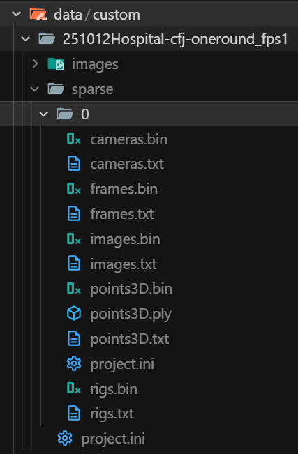

#### 4.2 Configure GS2Mesh Environment
Configure the GS2Mesh environment according to Git instructions. Key considerations:
- Potential issues: CUDA environment path and version conflicts. The server currently has at least four CUDA versions installed.
- Export the corresponding CUDA version in `.bashrc` to avoid installation errors. Configuration example:
  ```bash
  export PATH=/usr/local/cuda-11.8/bin:$PATH
  export LD_LIBRARY_PATH=/usr/local/cuda-11.8/lib64:$LD_LIBRARY_PATH
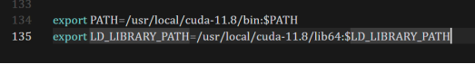
  ### 4.3 Run the Full GS2Mesh Pipeline
After configuring the GS2Mesh environment, enter the corresponding command to run the full GS2Mesh pipeline:
- **Runtime Configuration**: Single GPU training, single program.
- **VRAM Usage**: Approximately 4000MB.
- **Training Duration**: About 50 minutes.
- **Result Storage**: Training results are saved to the `output` folder and `splatting_output` folder.

#### 4.3.1 Output Folder Structure
The `output` folder contains intermediate iteration results and final model files, with the following structure:
- Root directory: `output/custom_nw_iterations30000_DLNR_Middlebury_baselin.../`
- Subdirectory: `251012Hospital-cfj-oneround_fps1/`
  - Intermediate iterations: Folders named from `000` to `049`
  - Final model files: `251012Hospital-cfj-oneround_fps1_custom_nw_iterations30...` (two files with similar names)
  - Auxiliary file: `camera_data.json`
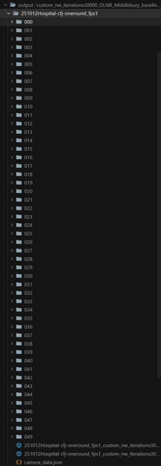
#### 4.3.2 Splatting_Output Folder Structure
The `splatting_output` folder stores point cloud data and training logs, with the following structure:
- Root directory: `splatting_output/custom_nw_iterations30000/`
- Subdirectory: `2024-04-25-091505_split_fps_5_vflip/251012Hospital-cfj-oneround_fps1/`
  - Point cloud data: 
    - `point_cloud/iteration_7000/point_cloud.ply` (point cloud at 7000 iterations)
    - `point_cloud/iteration_30000/point_cloud.ply` (point cloud at 30000 iterations, final version)
  - Configuration and log files:
    - `cameras.json` (camera parameter configuration)
    - `cfg_args` (training configuration parameters)
    - `events.out.tfevents.1763030607.ubuntu-AS-4124GS-TNR.4057297.0` (TensorFlow event log)
    - `input.ply` (input point cloud data)
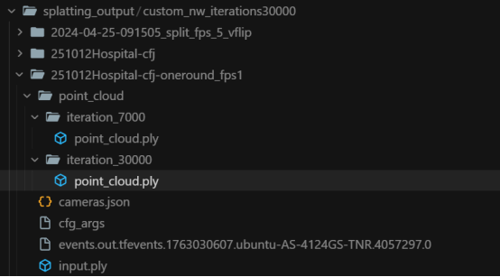
### 4.4 Download and View the Reconstructed Model
Download the final PLY file from the `output` folder (e.g., `251012Hospital-cfj-oneround_fps1_custom_nw_iterations30000_DLNR_Middlebury_bas...`) to the local machine. Use CloudCompare to open and view the file, which is a 3D head model rendered by 3DGS.
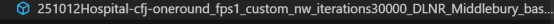

#### Key Comparison
- **GS2Mesh Model**: Due to the 360° surround shooting angle, it achieves full-directional reconstruction (including the back of the head).
- **3DMD Model**: Only reconstructs the facial region because the shooting lacks back-of-the-head perspectives.

## 5. Convert 3DMD Mesh Data
### 5.1 Data Format Overview
The mesh data captured by 3DMD is in OBJ format. The target files are the OBJ files under the `meshes` directory of the 3DMD dataset. These OBJ files need to be converted to PLY format using trimesh for subsequent registration.
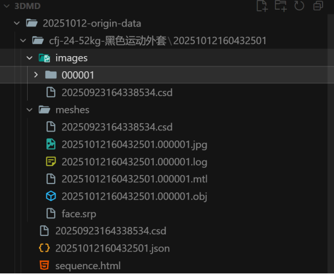
### 5.2 Trimesh Environment Setup
- **Installation Method**: Use `requirements.txt` for one-click Conda installation.
- **Critical Note**: The new version of trimesh (e.g., 4.8.3) has poor performance, leading to distorted results and incorrect attribute counts. It is strongly recommended to use trimesh version 4.5.3.

### 5.3 Format Conversion and File Naming
1. **Conversion Operation**: Convert the 3DMD OBJ file to PLY format using trimesh. The converted file is referred to as `3dmd-ply`, and the PLY file generated by GS2Mesh is referred to as `gs2mesh-ply`.
2. **Optional Renaming**:
   - Rename `gs2mesh-ply` to `Rento_COLMAP.ply`.
   - Rename `3dmd-ply` to `Rento.ply`.
   - Reason: Most functions in `gs2mesh_util` use these default filenames (set by Shiyan). If not renamed, manual specification of `args` parameters in the subsequent script is required.

## 6. Point Cloud Registration in CloudCompare
### 6.1 Preparatory Operations
1. **Import Files**: Open CloudCompare, click "File - Open" in the upper left corner, and import the two PLY files (`Rento_COLMAP.ply` and `Rento.ply`).
2. **Camera Setting Adjustment**: Click "View - Camera Settings", and disable the "Near Clipping Depth" and "Far Clipping Depth" options to prevent the target model from moving out of the field of view during registration.
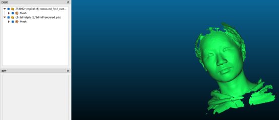
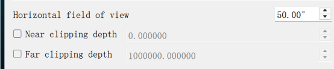
### 6.2 Scaling Optimization (Updated Operation)
#### Historical Operation (Deprecated)
Previously, `gs2mesh-ply` needed to be scaled up by 160x:
1. Select the `gs2mesh-ply` model (ensure it is selected; otherwise, subsequent operations cannot be performed).
2. Click "Edit - Multiply/Scale".
3. Set the scaling factor to 160.00000000 for all dimensions (X, Y, Z) with the default configuration, and keep the entity in place.
4. After scaling, the facial sizes of the two PLY models are consistent for subsequent registration.
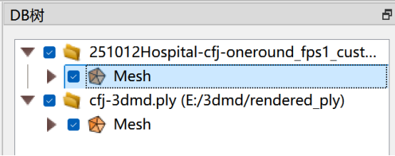
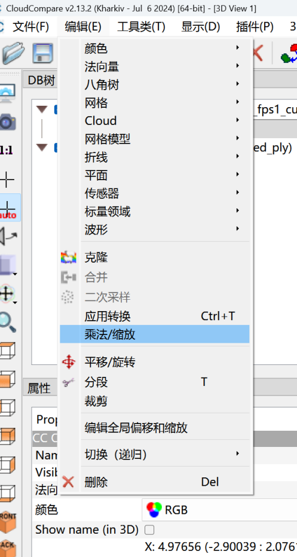
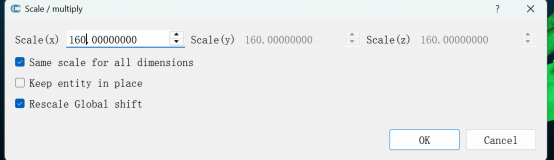
#### Updated Operation (Recommended)
During the OBJ-to-PLY conversion of 3DMD data, directly set `scale=0.00625` (i.e., 1/160). This avoids the need for additional scaling operations in CloudCompare and prevents scale mutations during ICP registration caused by the scaling matrix.

### 6.3 Normal Vector Repair
1. **Problem Description**: During the OBJ-to-PLY conversion, the original normal vector information is not retained, resulting in only 6 attributes (3 for coordinates) being displayed after importing into CloudCompare (3 normal vector attributes are lost). This causes the model surface to appear blurred.
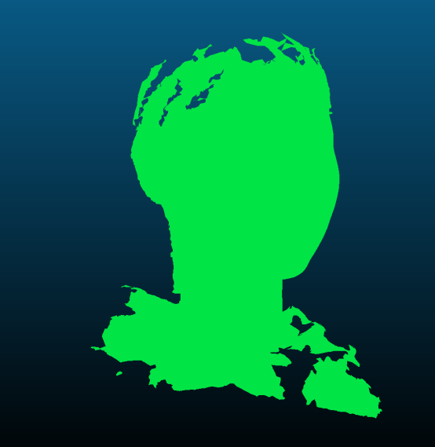
2. **Repair Steps**:
   - Select the model with missing normals.
   - Click "Edit - Normals - Compute" to recalculate the normals.
   - **Calculation Method Selection**: Two methods are available—face normals and vertex normals. There is no obvious visual difference, but theoretically, vertex normals are smoother (vertex normals are generally the average of adjacent face normals).
   - **Effect**: After selecting vertex normals, the human contour on the model surface becomes clearly visible.
   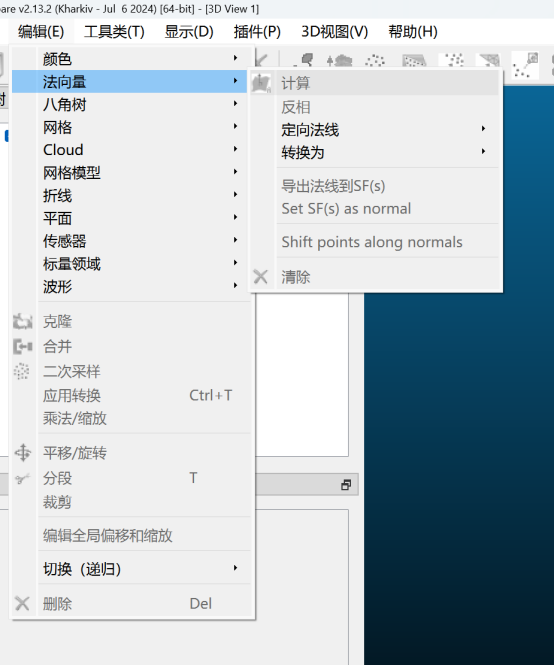
3. **Simplified Operation**: Import both models simultaneously, select the 3DMD model, and export its normals to simplify the subsequent registration process.

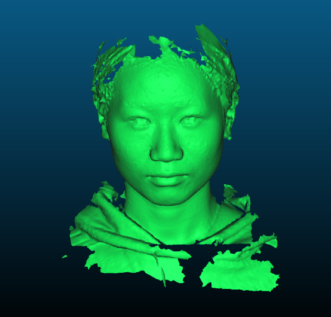
### 6.4 Registration Steps
#### 6.4.1 Rough Registration (Point-Pair Selection)
1. Select both the GS2Mesh-generated model and the 3DMD-converted model.
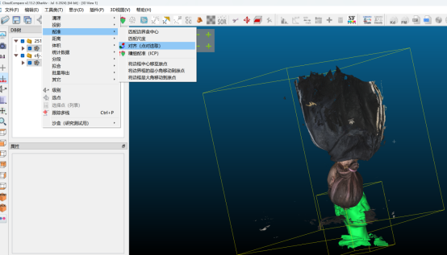
2. Click "Tools - Registration - Align (Point-Pair Selection)" to start rough registration.
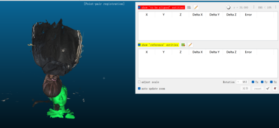
3. Select one model as the "to be aligned" entity and the other as the "reference" entity.
4. In the point-pair registration window, check only the "show 'to be aligned' entities" box; the reference model will be hidden.
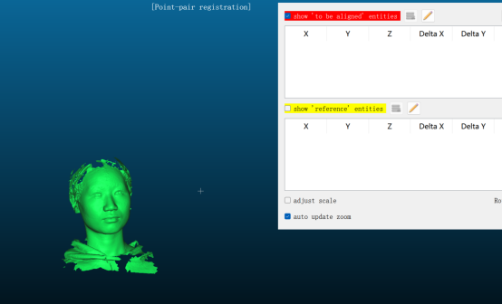
5. Select corresponding point pairs on the two models (the more pairs, the better). Commonly used feature points include: left/right edges of glasses, bottom of the nasal columella, left/right edges of the lips, etc.
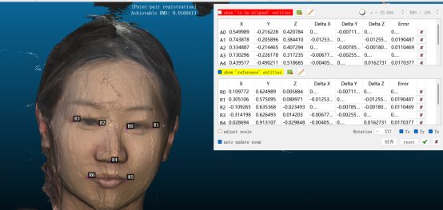
6. After selecting the point pairs, click "Align". It is recommended to check the "adjust scale" option to minimize the RMS (Root Mean Square) error:
   - Without scaling: RMS error is approximately 3-10.
   - With scaling: RMS error is reduced to 0.01-0.03.
   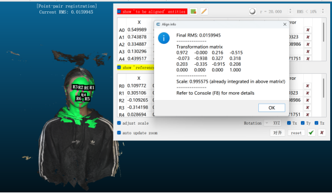
7. Click "OK" to complete rough registration. A summary message will pop up, including the transformation matrix. Record this matrix (it will also be displayed in the Console, accessible via F8).

#### 6.4.2 Fine Registration (ICP)
1. After rough registration, select "Tools - Registration - Fine Registration (ICP)" to perform iterative closest point matching.
2. **Parameter Configuration**: Do not check the "adjust scale" option. Run with default parameters (adjusting parameters such as RMS difference or number of iterations has been tested and results in worse performance than rough registration alone).
3. **Note**: The rough registration result is already sufficiently accurate; fine registration may not significantly improve the effect and may even introduce errors.
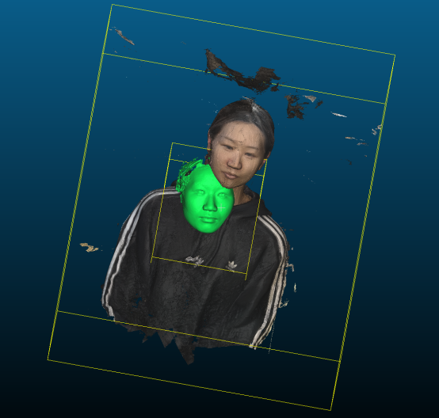

### 6.5 Model Evaluation
1. Place the two registered PLY files into the `Rento` folder and ensure the filenames match the requirements (or manually specify the file paths in the script).
2. Run the evaluation script:
   ```bash
   python gs2mesh/evaluation/TNT2/eval_code/python_toolbox/evaluation/run.py
3. The evaluation results will be displayed in the Console.
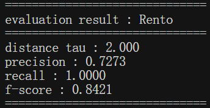